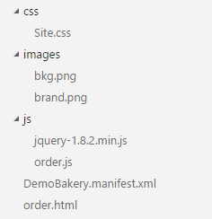

# Outlook Add-in pro Pekárnu Bakery
Jako první vytvoříme add-in pro Outlook, který pozná, že zpráva obsahuje ID objednávky, aktivuje se a zobrazí fiktivní informaci o jejím stavu.

Add-in bude fungovat jak v desktopovém Outlooku pro Windows, tak v tom webovém (OWA). Jakmile služba Outlook.com (bývalý Hotmail) přejde na stejný backend, bude add-in fungovat i tam.

## Příprava
Výchozí web [Web-Start](../Web-Start) musí být správně nakonfigurovaný, aby používal tentant Office 365 a přihlásil konkrétního uživatele.

V souboru `Order.cshtml` je potřeba vyplnit patřičné údaje:

```csharp
	//Enter your Office 365 credentials for UserName/Password and a "From" address for the e-mail
	WebMail.UserName = "<user>@<tenant>.onmicrosoft.com";
	WebMail.Password = "<password>";
	WebMail.From = "<user>@<tenant>.onmicrosoft.com";
```

* **user** je jméno uživatele Office 365, kterého budeme používat pro odesílání e-mailu a zároveň spouštění aplikace pro Outlook.
* **password** je jeho heslo.
* **tenant** je název tenantu Office 365.

Hodnoty `WebMail.UserName` a `WebMail.From` musí být stejné. Nastavení odlišné adresy popisujeme [v tomto článku](http://blogs.msdn.com/b/vyvojari/archive/2014/11/04/jak-pouzit-office-365-pro-posilani-e-mailu.aspx).

## Outlook Add-in jednoduše
Jako první vytvoříme jednoduchý add-in pro Outlook bez Visual Studia. Vystačíme si s textovým editorem a trochou HTML a JavaScriptu.

### Jádro aplikace
Minimální add-in pro Office tvoří vždy soubor manifestu (XML) a webová aplikace. Oboje umí vygenerovat Visual Studio automaticky, protože ho ale nepoužíváme, použijeme již hotový kód:
1. Založte si **novou složku**, v které budete aplikaci tvořit.
1. Vytvořte nový prázdný soubor a pojmenujte ho **DemoBakery.manifest.xml** (název může být libovolný, tento volíme hlavně pro přehlednost).
1. Vložte do něj následující XML:
	```xml
	<?xml version="1.0" encoding="UTF-8"?>
	<OfficeApp xmlns="http://schemas.microsoft.com/office/appforoffice/1.1" xmlns:xsi="http://www.w3.org/2001/XMLSchema-instance" xsi:type="MailApp">
		<Id>cada311b-1267-4463-a872-2af23521ccbb</Id>
		<Version>1.0.0.0</Version>
		<ProviderName>Tester</ProviderName>
		<DefaultLocale>en-US</DefaultLocale>
		<DisplayName DefaultValue="Fourth Coffee" />
		<Description DefaultValue="DemoBakery.Outlook"/>
		<Hosts>
			<Host Name="Mailbox" />
		</Hosts>
		<Requirements>
			<Sets>
			<Set Name="MailBox" MinVersion="1.1" />
			</Sets>
		</Requirements>
		<FormSettings>
			<Form xsi:type="ItemRead">
			<DesktopSettings>
				<SourceLocation DefaultValue="https://<URL>/order.html"/>
				<RequestedHeight>250</RequestedHeight>
			</DesktopSettings>
			<TabletSettings>
				<SourceLocation DefaultValue="https://<URL>/order.html" />
				<RequestedHeight>150</RequestedHeight>
			</TabletSettings>
			</Form>
		</FormSettings>
		<Permissions>ReadItem</Permissions>
		<Rule xsi:type="RuleCollection" Mode="And">
			<Rule xsi:type="ItemIs" ItemType="Message" FormType="Read" />
			<Rule xsi:type="ItemHasRegularExpressionMatch" RegExName="BAKID" RegExValue="#BAKID:(.*){36}" PropertyName="BodyAsPlaintext" />
		</Rule>
		<DisableEntityHighlighting>false</DisableEntityHighlighting>
	</OfficeApp>
	```
	* Nastavujeme základní informace o aplikaci, které se zobrazí uživateli, a také specifikujeme, že se aplikace týká mailboxu, konkrétně čtení (`ItemRead`).
	* Podstatná je také sekce **`Rule`** - říkáme, že položka musí být e-mail *a* že v něm musí být text, který odpovídá regulárnímu výrazu `#BAKID:(.*){36}`. Výraz máme pojmenovaný jako `BAKID`.

*Dokumentaci k souboru manifestu najdete zde: https://msdn.microsoft.com/en-us/library/office/fp161044.aspx.*

Jakmile máme manifest hotový, začneme sestavovat samotnou funkctionalitu aplikace. Bude ji tvořit jednoduchá webová stránka bez serverové části.
1. Vytvořte ve své složce vedle manifestu nový prázdný soubor **order.html**.
1. Vložte do něj tento HTML kód:
	```html
	<!DOCTYPE html>
	<html>
		<head>
			<meta charset="UTF-8" />
			<meta http-equiv="X-UA-Compatible" content="IE=Edge" />
			<title></title>
			<script src="js/jquery-1.8.2.min.js" type="text/javascript"></script>
			<link href="css/Office.css" rel="stylesheet" type="text/css" />
			<script src="https://appsforoffice.microsoft.com/lib/1/hosted/office.js" type="text/javascript"></script>
			<script src="js/order.js" type="text/javascript"></script>
			<link href="css/Site.css" rel="stylesheet" type="text/css" />
		</head>
		<body>
			<div>
				<div>
					<h2>Order details</h2>
					<p id="orderDetails"></p>
					
				</div>
			</div>
		</body>
		</html>
	```
	* Podstatné v tomto souboru je načtení **office.js** z CDN. Díky tomuto skriptu je možné vkládat aplikace do Office a pracovat s obsahem (dokumenty, e-maily, kalendářem...).
1. Vytvořte ve stejném adresáři složku **js**.
1. Vytvořte v ní prázdný soubor **order.js**.
1. Vložte do něj tento kód:
	```js
	(function () {
		"use strict";
	
		// The Office initialize function must be run each time a new page is loaded
		Office.initialize = function (reason) {
			$(document).ready(function () {
				displayOrderDetails();
			});
		};
	
		function displayOrderDetails() {
			var rawId = Office.context.mailbox.item.getRegExMatches().BAKID;
			var id = rawId[0].split(':');
			$('#orderDetails').html("<b>Order:</b> " + id[1] + "<br /> <b>Status:</b> Processing at coffee shop.");
		}
	})();
	```
	* Skript se zapojí do inicializace Office a přidá volání jedné funkce. Z toho důvodu je nutné ho volat až po načtení *Office.js*.
	* `displayOrderDetails` se podívá do těla e-mailu a přečte z něj hodnotu, která odpovídá nastavenému regulárnímu výrazu. Výsledky jsou v poli, protože jich e-mail může obsahovat víc. My si vezmeme hned ten první.
	* Pro jednoduchost se skript nepřipojuje nikam na backend, ale jednoduše vypisuje staticky stav. V reálné aplikaci by zavolal na server a zjistil aktuální stav objednávky.

### Podpůrné soubory
Tímto máme jádro aplikace hotové a ještě doplníme podpůrné soubory, které jsou pro její správný běh nutné.

1. Do složky **js** zkopírujte soubor **jquery-1.8.2.min.js** z projektu Web-Start (složka *Scripts*).
1. Vytvořte novou složku **css** a zkopírujte do ní soubory **Office.css** a **Site.css** z projektu Web-Start (složka *Content*).
1. Vytvořte novou složku **images** a zkopírujte do ní soubory **bkg.png**, **brand.png** a **Close.png**.

Výsledná struktura by měla vypadat takto:



## Nasazení aplikace na server
